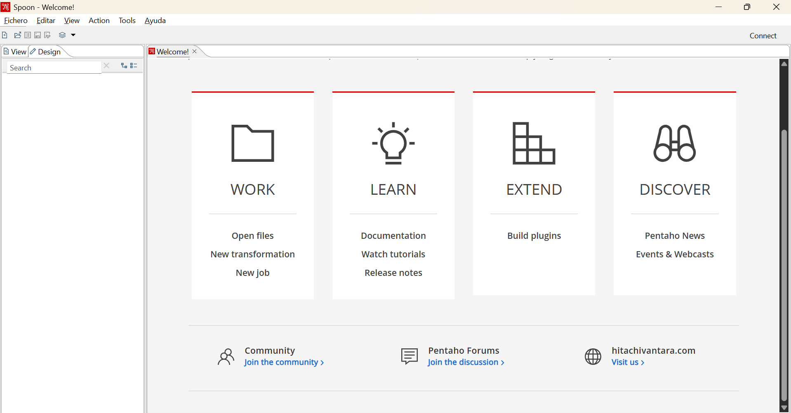

# Práctica 1
1. Seleccionar la base de datos con la cual desean realizar las practicas. Las opciones son :
- **Delivery**
    - Base de datos de ventas de comida para retirar o entregar.

- **Vuelos**
    - Base de datos de un sistema de reserva de vuelos https://postgrespro.com/community/demodb

    La Base de datos seleccionada es **Delivery**.

2. Importar la base de datos e indicar el tamaño de las 4 tablas con mayor cantidad de registros.

    Para importar la base de datos, se siguieron los siguientes pasos:
    - Creamos una conexión `MariaDB` en `DBeaver`
    - Creamos y seleccionamos la base de datos `tabi2025`
    - Click derecho sobre la base de datos y navegamos hasta `Herramientas --> Execute script` e importamos el archivo .sql provisto por la cátedra.

    Una vez seguidos estos pasos, ya tenemos importada la base de datos. Para obtener el tamaño de las 4 tablas con mayor cantidad de registros, se ejecuto el siguiente script SQL:

    ```SQL
        SELECT
        table_name AS Tabla,
        table_rows AS Cantidad_Registros,
        ROUND((data_length + index_length) / 1024 / 1024, 2) AS Tamaño_MB
        FROM information_schema.tables
        WHERE table_schema = 'tabi2025'
        ORDER BY Tamaño_MB DESC
        LIMIT 4;
    ```

    Cabe destacar que para el tamaño de los registros, se tuvo en cuenta el `data_length`, que es el tamaño de los datos en bytes, y el `index_length` que es el tamaño de los indices en bytes.

3. Elijan al menos 2 puntos de vista, o roles relacionado al sistema y escriban al menos 4 consultas en lenguaje natural para cada rol que crean que son interesantes de responder. 
(Ej. para el sistema de vuelos, un rol podría ser el del agente de venta que se interesa en frecuencia, disponibilidad, etc. y otro rol podría ser el del Ing. Naval que quiere conocer datos de eficiencia como consumo de combustible por pasajero.)

    Para tener un mejor panorama acerca de la información que nos puede aportar la base de datos, miramos el diagrama ER de la misma.

    

    A partir de la vizualización y entendimiento de la base de datos, se plantean los siguientes dos roles y consultas en lenguaje natural:

    - **Rol: Gerente de ventas**

        1. nombre de zonas donde se registraron mas ventas en un periodo dado.
        2. Nombre y tipo de proveedores que realizaron mas ventas. 
        3. Total de ventas realizadas y tipo de pago utilizado en un periodo dado.
        4. Monto promedio de venta por cliente.

    - **Rol: Gerente de proveedores**

        1. Proveedores que tienen asignadas mayor cantidad de ventas.
        2. Tipos de proveedores que generan mayores ventas.
        3. Zonas que tienen mas proveedores activos.
        4. Cantidad de ventas, periodo de tiempo de actividad y zona por proveedor.

4. Descargar e Instalar Pentaho Data Integration

    Si se pudo:
    
    
             

