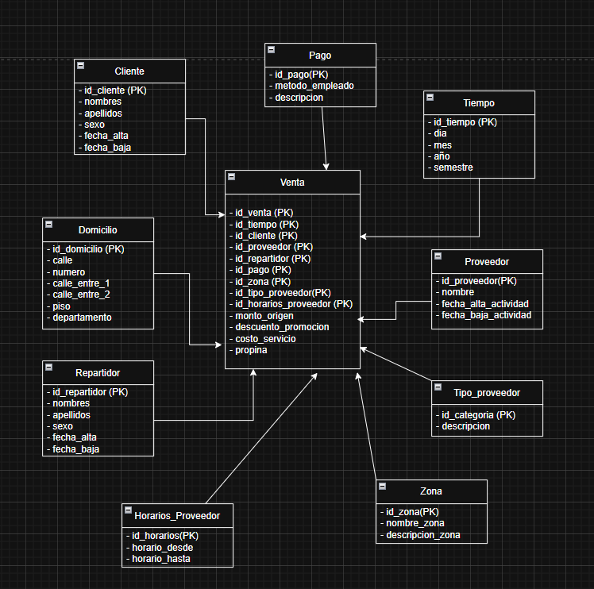

# Práctica 2

##### 1-. Copiar 6 consultas de la práctica anterior, y sombrear con <span style="color:orange;">color naranja</span> los términos correspondientes a dimensiones y con <span style="color:green;"> color verde</span> los términos correspondientes a medidas.

En nuestro caso, modificamos un poco las consultas para que sean más variadas y abarquen mas dimensiones y medidas.

- **Rol: Gerente de ventas**

  1. <span style="color:orange">Zonas</span> donde se registraron más <span style="color:green">ventas</span> en un <span style="color:orange">periodo dado.
  2. Identificar los picos de <span style="color:green">ventas</span> agrupados por <span style="color:orange">hora</span> durante los últimos 3 meses, diferenciando <span style="color:orange">fines de semana</span> y <span style="color:orange">días hábiles</span>, para analizar los momentos de mayor demanda.
  3. Identificar el top 10 de <span style="color:orange">zonas</span> con mayor monto acumulado de <span style="color:green">descuentos aplicados</span> por <span style="color:green">promociones</span>, analizado según <span style="color:green">tipo de promoción</span>, <span style="color:green">tipo de pago</span> y <span style="color:green">período de tiempo</span>.

<br>

- **Rol: Gerente de proveedores**

  1. Identificar los <span style="color:orange">proveedores</span> con mayor <span style="color:green">cantidad de clientes</span> únicos atendidos durante el <span style="color:green">último trimestre</span>, agrupados por <span style="color:green">tipo de proveedor</span>.
  2. Obtener el top 3 de <span style="color:orange">tipos de proveedores</span> con mayor <span style="color:green">cantidad de ventas</span> por <span style="color:orange">zona</span>, considerando el <span style="color:orange">año en curso.
  3. <span style="color:orange">Proveedores</span> que realizaron <span style="color:orange">ventas</span> con <span style="color:green">descuento</span> por promoción mayor a $5000 en un determinado <span style="color:orange">horario</span> por <span style="color:orange">zona.

##### 2-.Elija 4 consultas de la practica 1 y escriba las consultas SQL necesarias para responderlas.

Se van mencionando las consultas seleccionadas y su correspondiente resolución en SQL.

- 1️⃣ Proveedores que realizaron ventas con descuento por promoción mayor a $5000 en un horario determinado por zona

```sql
SELECT 
    p.nombre AS proveedor,
    dz.nombre AS zona,
    v.fecha_hora,
    v.descuento_promocion
FROM venta v
JOIN proveedor p ON v.proveedor_id = p.id
JOIN cliente c ON v.cliente_id = c.id
JOIN domicilio d ON c.domicilio_id = d.id
JOIN domicilio_zona dz ON d.zona_id = dz.id
WHERE v.descuento_promocion > 5000
  AND CAST(v.fecha_hora AS TIME) BETWEEN '18:00:00' AND '22:00:00'
ORDER BY dz.nombre, v.fecha_hora DESC;
```

- 2️⃣ Picos de **ventas por hora** durante los últimos 3 meses, diferenciando **fines de semana** y **días hábiles**


```sql

SELECT 
    EXTRACT(HOUR FROM v.fecha_hora) AS hora,
    CASE 
        WHEN EXTRACT(ISODOW FROM v.fecha_hora) IN (6,7) THEN 'Fin de semana'
        ELSE 'Día hábil'
    END AS tipo_dia,
    COUNT(v.id) AS total_ventas
FROM venta v
WHERE v.fecha_hora >= (CURRENT_DATE - INTERVAL '3 months')
GROUP BY hora, tipo_dia
ORDER BY tipo_dia, hora;

 -- EXTRACT(ISODOW) -> Permite ver en qué horas se concentran las ventas y cómo difieren entre fines de semana y días hábiles.

```

- 3️⃣ Top 10 zonas con mayor monto acumulado de descuentos por promoción, analizado por tipo de promoción, tipo de pago y período de tiempo.

```sql
SELECT 
    dz.nombre AS zona,
    tp.descripcion AS tipo_pago,
    SUM(v.descuento_promocion) AS total_descuento,
    DATE_TRUNC('month', v.fecha_hora) AS periodo
FROM venta v
JOIN cliente c ON v.cliente_id = c.id
JOIN domicilio d ON c.domicilio_id = d.id
JOIN domicilio_zona dz ON d.zona_id = dz.id
JOIN pago p ON p.venta_id = v.id
JOIN tipo_pago tp ON p.tipo_id = tp.id
WHERE v.fecha_hora >= (CURRENT_DATE - INTERVAL '6 months')
GROUP BY dz.nombre, tp.descripcion, periodo
ORDER BY total_descuento DESC
LIMIT 10;
```


- 4️⃣Top 3 tipos de proveedores con mayor cantidad de ventas por zona (año en curso).

```sql

SELECT zona, tipo_proveedor, total_ventas
FROM (
    SELECT 
        dz.nombre AS zona,
        tp.descripcion AS tipo_proveedor,
        COUNT(v.id) AS total_ventas,
        ROW_NUMBER() OVER (PARTITION BY dz.nombre ORDER BY COUNT(v.id) DESC) AS rn
    FROM venta v
    JOIN proveedor p ON v.proveedor_id = p.id
    JOIN tipo_proveedor tp ON p.tipo_id = tp.id
    JOIN cliente c ON v.cliente_id = c.id
    JOIN domicilio d ON c.domicilio_id = d.id
    JOIN domicilio_zona dz ON d.zona_id = dz.id
    WHERE EXTRACT(YEAR FROM v.fecha_hora) = EXTRACT(YEAR FROM CURRENT_DATE)
    GROUP BY dz.nombre, tp.descripcion
) sub
WHERE rn <= 3
ORDER BY zona, total_ventas DESC;

```

##### 3-. Definir un modelo dimensional conceptual que contenga Hechos y Dimensiones, que sea suficiente para responder a las consultas del punto anterior. Tener presente que el modelo pueda eventualmente responder nuevas consultas no previstas inicialmente.

Se emplea el modelo conceptual de tipo estrella dada su adaptabilidad y empleo en futuras aplicaciones en clase




**Hecho principal: Venta**


##### 4-. Especificar la granularidad del modelo.

La granularidad está dada por **HECHO_VENTA** contando así con ventas individuales realizada por un cliente a un proveedor, en un momento determinado, con un repartidor asignado, a través de un tipo de pago específico.
